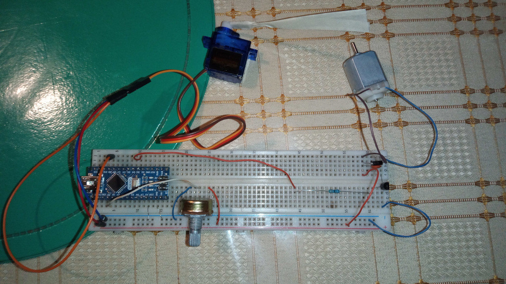

# Aplicativo

Programa que, utilizando el SO XINU RTOS (timer0) junto al timer1 y al timer2 del Arduino Nano, realiza de manera concurrente las siguientes tareas ordenadas por prioridad (número más bajo indica mayor prioridad y mismo número indica prioridad compartida):
- (1) Mantener un reloj de tiempo real con 00:00:00 como comienzo de ejecución (Realizado por Timer 1).
- (1) Generar señal PWM del servo (Realizado por Timer 1).
- (1) Invertir señal del LED del Arduino Nano (Realizado por Timer 1).
- (1) General señal PWM del motor de CC (Realizado por Timer 2).
- (1) Fijar el ángulo del servo al valor actual (valor inicial es 0).
- (2) Fijar la velocidad del motor de CC al valor recibido por ADC.
- (3) Recibir por puerto serie pulsaciones de teclado, **a** gira el servo a la izquierda 1 grado (con tope 0 grados), **d** gira el servo a la derecha 1 grado (con tope 180 grados), **b** detiene el motor y **n** lo hace funcionar de nuevo.
- (4) Recibir por ADC el valor enviado por un potenciómetro.
- (4) Fijar la velocidad de inversión (parpadeo) del LED del Arduino Nano de manera inversamente proporcional a la velocidad del motor.
- (5) Enviar por el puerto serie cada 1 segundo un reporte con los valores actuales del reloj, la velocidad del motor y el ángulo del servo.

Para que la PC pueda recibir los reportes y enviar pulsaciones se debe ejecutar *tio -b 9600 /dev/ttyUSB0* en una consola abierta en cualquier directorio.

Nota: la velocidad del motor de CC escala, a nivel voltaje, entre 0% y 80% (que es 100% en el reporte) para no dañar el puerto USB y/o el Arduino Nano.

# Instalación

Se requiere:
- 1 servo SG9
- 1 motor de CC de 5V
- 1 potenciómetro de 10kΩ
- 1 resistencia de 330Ω
- 1 transistor 2N2222A
- 1 diodo 1N4007
- 1 capacitor de 0.1µF

Las conexiones son:
- Pin 5V de Arduino Nano a VCC de protoboard
- Pin GND de Arduino Nano a GND de protoboard
- Pin izquierdo de knob a GND de protoboard
- Pin central de knob a Pin A0 de Arduino Nano
- Pin derecho de knob a VCC de protoboard
- Pin VCC de servo a VCC de protoboard
- Pin GND de servo a GND de protoboard
- Pin PWM de servo a Pin D9 de Arduino Nano
- Pata izquierda de resistencia a Pin D3 de Arduino Nano
- Pin Base de transistor a Pata derecha de resistencia
- Pin Emisor de transistor a GND de protoboard
- Pin Colector de transistor a pata derecha del motor de CC
- Pata izquierda de capacitor a Pata izquierda del motor de CC
- Pata derecha de capacitor a Pata derecha del motor de CC
- Negativo del diodo a pata derecha del motor de CC
- Positivo del diodo a pata izquierda del motor de CC
- Positivo del diodo a VCC de protoboard

Nota: Pata izquierda y Pata derecha se definen a gusto.

El circuito resultante debería ser similar al siguiente:

Grabar en el Arduino Nano con consola abierta en el directorio **compile**:
1. make
2. make flash

En caso de error, comprobar que el Arduino Nano esté correctamente conectado y que la variable PUERTO del Makefile coincida con el reportado por _ls /dev_, también probar cambiando variable BPS por 57600.

En la PC se debe tener instalada la aplicación *tio* (obtenible desde repositorios de Linux), en teoría cualquier otra aplicación para comunicarse por puerto serie debería funcionar.
